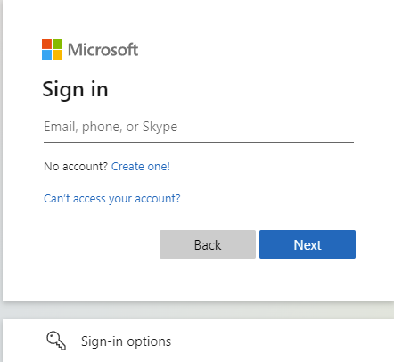
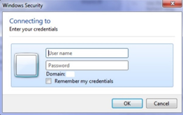
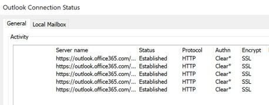
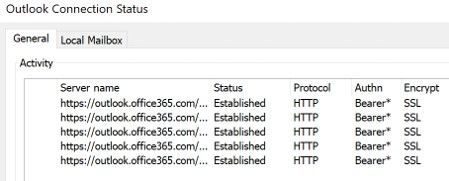

# Deprecation of Basic authentication in Exchange Online 

For many years, applications have used Basic authentication (also known as Legacy authentication) to connect to servers, services, and API endpoints. Basic authentication simply means the application sends a username and password with every request, and those credentials are also often stored or saved on the device. Traditionally, Basic authentication is enabled by default on most servers or services, and is simple to set up. 

Simplicity isn’t at all bad, but Basic authentication makes it easier for attackers to capture user credentials (particularly if the credentials are not protected by TLS), which increases the risk of those stolen credentials being reused against other endpoints or services. Furthermore, the enforcement of multifactor authentication (MFA) is not simple or in some cases, possible when Basic authentication remains enabled. 

Basic authentication is an outdated industry standard. Threats posed by it have only increased since we originally announced that we were going to turn it off (see [Improving Security - Together](https://techcommunity.microsoft.com/t5/exchange-team-blog/improving-security-together/ba-p/805892)) There are better and more effective user authentication alternatives. 

We actively recommend that customers adopt security strategies such as [Zero Trust](/security/blog/2018/06/14/building-zero-trust-networks-with-microsoft-365/) (Never Trust, Always Verify), or apply real-time assessment policies when users and devices access corporate information. These alternatives allow for intelligent decisions about who is trying to access what from where on which device rather than simply trusting an authentication credential that could be a bad actor impersonating a user. 

With these threats and risks in mind, we’re taking steps to improve data security in Exchange Online. 

## What we are changing 

We’re removing the ability to use Basic authentication in Exchange Online for Exchange ActiveSync (EAS), POP, IMAP, Remote PowerShell, Exchange Web Services (EWS), Offline Address Book (OAB), Outlook for Windows, and Mac.  

We’re also disabling SMTP AUTH in all tenants in which it’s not being used.  

This decision requires customers to move from apps that use basic authentication to apps that use Modern authentication. Modern authentication (OAuth 2.0 token-based authorization) has many benefits and improvements that help mitigate the issues in basic authentication. For example, OAuth access tokens have a limited usable lifetime, and are specific to the applications and resources for which they are issued, so they cannot be reused. Enabling and enforcing multifactor authentication (MFA) is also simple with Modern authentication. 

## When will this change take place? 

We’ve already started making this change. New Microsoft 365 tenants are created with Basic authentication already turned off as they have [Security defaults](/azure/active-directory/fundamentals/concept-fundamentals-security-defaults) enabled. 

Beginning in early 2021, we started to disable Basic authentication for existing tenants with no reported usage. We always provide Message Center notifications to any customer prior to Basic authentication being disabled in their tenant. 

In September 2021, we announced that effective **October 1, 2022**, we will begin disabling Basic authentication for Outlook, EWS, RPS, POP, IMAP, and EAS protocols in Exchange Online. SMTP Auth will also be disabled if it is not being used. See full announcement: [Basic Authentication and Exchange Online – September 2021 Update](https://techcommunity.microsoft.com/t5/exchange-team-blog/basic-authentication-and-exchange-online-september-2021-update/ba-p/2772210).

## Impact to messaging protocols and existing applications 

This change affects the applications and scripts you might use in different ways.  

### POP, IMAP, and SMTP AUTH 

In 2020, we released OAuth 2.0 support for POP, IMAP, and SMTP AUTH. Updates to some client apps have been updated to support these authentication types (for example, Thunderbird), so users with up-to-date versions can change their configuration to use OAuth. There is no plan for Outlook clients to support OAuth for POP and IMAP, but Outlook can connect use MAPI/HTTP (Windows clients) and EWS (Outlook for Mac).  

Application developers who have built apps that send, read, or otherwise process email using these protocols will be able to keep the same protocol, but need to implement secure, Modern authentication experiences for their users. This functionality is built on top of [Microsoft Identity platform v2.0](/azure/active-directory/develop/v2-overview) and supports access to Microsoft 365 email accounts. 

If your in-house application needs to access IMAP, POP and SMTP AUTH protocols in Exchange Online, follow these step-by-step instructions to implement OAuth 2.0 authentication:  [Authenticate an IMAP, POP, or SMTP connection using OAuth](/exchange/client-developer/legacy-protocols/how-to-authenticate-an-imap-pop-smtp-application-by-using-oauth). 

Work with your vendor to update any apps or clients that you use that could be impacted.

SMTP AUTH will still be available when Basic authentication is permanently disabled on October 1, 2022. The reason SMTP will still be available is that many multi-function devices such as printers and scanners can’t be updated to use modern authentication. However, we strongly encourage customers to move away from using Basic authentication with SMTP AUTH when possible. Other options for sending authenticated mail include using alternative protocols, such as the [Microsoft Graph API](/graph/api/user-sendmail). 

### Exchange ActiveSync (EAS) 

Many users have mobile devices that are set up to use EAS. If they’re using Basic authentication, they will be impacted by this change. 

We recommend using [Outlook for iOS and Android](https://products.office.com/outlook-mobile-for-android-and-ios) when connecting to Exchange Online. Outlook for iOS and Android fully integrates Microsoft Enterprise Mobility + Security (EMS), which enables conditional access and app protection (MAM) capabilities. Outlook for iOS and Android helps you secure your users and your corporate data, and it natively supports Modern authentication. 

There are other mobile device email apps that support Modern authentication. The built-in email apps for all popular platforms typically support Modern authentication, so sometimes the solution is to verify that your device is running the latest version of the app. If the email app is current, but is still using Basic authentication, you might need to remove the account from the device and then add it back. 

### Exchange Online PowerShell 

Since the release of the Exchange Online V2 PowerShell module (abbreviated as the EXO V2 module) it’s been easy to manage your Exchange Online settings and protection settings from the command line using Modern authentication. The EXO V2 module uses Modern authentication and works with multifactor authentication (MFA) for connecting to all Exchange-related PowerShell environments in Microsoft 365: Exchange Online PowerShell, Security & Compliance PowerShell, and standalone Exchange Online Protection (EOP) PowerShell. 

The EXO V2 module can also be used non-interactively, which enables running unattended scripts. Certificate-based authentication provides admins the ability to run scripts without the need to create service-accounts or store credentials locally. To learn more, see: [App-only authentication for unattended scripts in the EXO V2 module](/powershell/exchange/app-only-auth-powershell-v2). 

Administrators who still use the old remote PowerShell connection method or the older Exchange Online Remote PowerShell Module (V1), are encouraged to begin using the EXO V2 module as soon as possible. These older connection methods will eventually be retired, either through Basic authentication disablement or the end of support. 

>[!Important]
> Do not confuse the fact that PowerShell requires Basic authentication enabled for WinRM (on the local machine where the session is run from). See: [Prerequisites for the EXO V2 module](/powershell/exchange/exchange-online-powershell-v2?view=exchange-ps#prerequisites-for-the-exo-v2-module)  
>
>The username/password isn't sent to the service using Basic, but the Basic Auth header is required to send the session's OAuth token, because the WinRM client doesn't support OAuth. We are working on this problem and will have more to announce in the future. Just know that enabling Basic on WinRM *is not* using Basic to authenticate to the service. 

### Exchange Web Services (EWS) 

Many applications have been created using EWS for access to mailbox and calendar data.  

In 2018, we announced that Exchange Web Services would no longer receive feature updates and we recommended that application developers switch to using Microsoft Graph. See [Upcoming changes to Exchange Web Services (EWS) API for Office 365](https://techcommunity.microsoft.com/t5/exchange-team-blog/upcoming-changes-to-exchange-web-services-ews-api-for-office-365/ba-p/608055).  

Many applications have successfully moved to Graph, but for those applications that have not, it’s noteworthy that EWS already fully supports Modern authentication. So if you can’t migrate to Graph yet, you can switch to using Modern authentication with EWS, knowing that EWS will eventually be deprecated. 

To learn more, see: 
- [Upcoming API Deprecations in Exchange Web Services for Exchange Online - Microsoft Tech Community](https://techcommunity.microsoft.com/t5/exchange-team-blog/upcoming-api-deprecations-in-exchange-web-services-for-exchange/ba-p/2813925) 
- [Authenticate an EWS application by using OAuth](/exchange/client-developer/exchange-web-services/how-to-authenticate-an-ews-application-by-using-oauth)

### Outlook, MAPI, RPC, and Offline Address Book (OAB) 

All versions of Outlook for Windows since 2016 have Modern authentication enabled by default, so it’s likely that you’re already using Modern authentication. Outlook Anywhere (formerly known as RPC over HTTP) has been deprecated in Exchange Online in favor of MAPI over HTTP. Outlook for Windows uses MAPI over HTTP, EWS, and OAB to access mail, set free/busy and out of office, and download the Offline Address Book. All of these protocols support Modern authentication. 

Outlook 2007 or Outlook 2010 cannot use Modern authentication, and will eventually be unable to connect. Outlook 2013 requires a setting to enable Modern authentication, but once you configure the setting, Outlook 2013 can use Modern authentication with no issues. As announced earlier here, Outlook 2013 requires a minimum update level to connect to Exchange Online. See:  [New minimum Outlook for Windows version requirements for Microsoft 365](https://techcommunity.microsoft.com/t5/microsoft-365-blog/new-minimum-outlook-for-windows-version-requirements-for/ba-p/2684142).

Outlook for Mac supports Modern Authentication.  

For more information about Modern authentication support in Office, see [How modern authentication works for Office client apps](/office365/enterprise/modern-auth-for-office-2013-and-2016). 

## How do you know if your users will be impacted? 

There are several ways to determine if you’re using Basic authentication or Modern authentication. If you’re using Basic authentication, you can determine where it’s coming from and what to do about it. 

### Authentication dialog 

A simple way to tell if a client app (for example, Outlook) is using Basic authentication or Modern authentication is to observe the dialog that’s presented when the user logs in. 

Modern authentication displays a web-based login page:  

 

Basic authentication presents a dialog credential modal box:

 

On a mobile device, you’ll see a similar web-based page when you authenticate if the device is trying to connect using Modern authentication. 

You can also check the connection status dialog box, by CTRL + right-clicking the Outlook icon in the system tray, and choosing Connection Status. 

When using Basic authentication, the **Authn** column in the **Outlook Connection Status** dialog shows the value of **Clear**. 

Once you switch to Modern authentication, the **Authn** column in the Outlook Connection Status dialog shows the value of **Bearer**. 

### Check the Message Center 

Starting at the end of 2021, we started sending Message Center posts to tenants summarizing their usage of Basic authentication. If you don’t use Basic authentication, you’ll probably have had Basic authentication turned off already (and received a Message Center post saying so)  – so unless you start using it, you won’t be impacted. 

If you did get a summary of usage, you’ll know how many unique users we saw using Basic authentication in the previous month, and which protocols they used. These numbers are indicative only, and do not necessarily reflect successful access to mailboxes or data. For example, a user may authenticate using IMAP, but be denied access to the mailbox due to configuration or policy. But the usage summary does indicate that something or someone is successfully authenticating to your tenant using Basic authentication. To investigate this usage further, we recommend that you use the Azure Active Directory Sign-in events report – a report that can provide detailed user, IP, and client details for these authentication attempts (more details below). 

### Check the Admin Center 

Early in 2022, we plan on updating the Microsoft Admin Center to make it easier to see summary usage and enable/disable protocols. We’ll publish more information on these changes when it becomes available. 

### Check the Azure Active Directory Sign-in report 

The best place to get the most up-to-date picture of Basic authentication usage by tenants is by using the Azure AD Sign-In report. To learn more, see: [New tools to block legacy authentication in your organization - Microsoft Tech Community](https://techcommunity.microsoft.com/t5/azure-active-directory-identity/new-tools-to-block-legacy-authentication-in-your-organization/ba-p/1225302). 

If you want to export logs for analysis, you require a premium license for your Azure AD tenant. If you have a premium license you can use the following methods to export logs:

- We recommend customers prioritize data export to Azure Event Hubs, Azure Storage, or Azure Monitor. Those export pathways are all capable of handling the load from even customer tenants with hundreds of thousands of users. For more information, see [Stream Azure Active Directory logs to Azure Monitor logs](/azure/active-directory/reports-monitoring/howto-integrate-activity-logs-with-log-analytics).
- You can also use Graph APIs to export sign-in logs, but we recommend you implement MS Graph paging logic to ensure you can pull in all the logs. For more information, see [Access Azure AD logs with the Microsoft Graph API](azure/active-directory/reports-monitoring/quickstart-access-log-with-graph-api).
- You can download logs directly from yoour browser, but for large customers the amount of data can cause browser timeouts. 

## Client options  

Some of the options available for each of the impacted protocols are listed below.

#### Protocol recommendation 

For Exchange Web Services (EWS), Remote PowerShell (RPS), POP and IMAP, and Exchange ActiveSync (EAS): 

- **If you have written your own code using these protocols**, update your code to use **OAuth 2.0** instead of Basic Authentication, or migrate to a newer protocol (Graph API).  
- **If you or your users are using a 3rd party application  which uses these protocols**, reach out to the 3rd party app developer who supplied this application to update it to support OAuth 2.0 authentication or assist your users to switch to an application that’s built using OAuth 2.0.  

|Key Protocol Service|Impacted Clients|Client specific Recommendation|Protocol Info / Notes |
|:-----|:-----|:-----|:-----|
|Outlook |All versions of Outlook for Windows and Mac |- Upgrade to Outlook 2013 or later for Windows and Outlook 2016 or later for Mac  - If you are using Outlook 2013 for Windows, turn on modern auth through the [registry key](/office365/admin/security-and-compliance/enable-modern-authentication) ||
|Exchange Web Services (EWS) |Third-party applications not supporting OAuth  |Modify app to use modern auth.  Migrate app to use Graph API and modern auth |No EWS feature updates starting July 2018| 
|Remote PowerShell (RPS)|- Exchange Administrators - [Delegated Admin Privileges](/partner-center/customers-revoke-admin-privileges) -  Automated management tools |Use either: - [PowerShell V2 Module](https://www.powershellgallery.com/packages/ExchangeOnlineManagement/2.0.5)  - [PowerShell within Azure Cloud Shell](https://techcommunity.microsoft.com/t5/Exchange-Team-Blog/Azure-Cloud-Shell-Now-Supports-Exchange-Online/ba-p/652269) ||Learn more about [Automation and cert auth support for Remote PowerShell MFA](/powershell/exchange/app-only-auth-powershell-v2). |
|POP and IMAP |Third party mobile clients such as Thunderbird first party clients configured to use POP or IMAP |Recommend moving away from these protocols as they don’t enable full features.   - Move to OAuth 2.0 for POP/IMAP when your client app supports it |IMAP is popular for Linux and education customers. OAuth 2.0 support started rolling out April 2020.  |
|Exchange ActiveSync (EAS) |Mobile email clients from Apple, Samsung etc.| Move to Outlook for iOS and Android or another mobile email app that supports Modern Auth Update the app settings if it can do OAuth but the device is still using Basic (remove and readd the account) Switch to Outlook on the web or another mobile browser app that supports modern auth |Mobile devices that use a native app to connect to Exchange Online generally use this protocol.| 

 

## What if I want to block Basic authentication now? 

Here’s a table summarizing the options for proactively disabling basic authentication 

|Method |Pros |Cons |
|:-----|:-----|:-----|
|Security Defaults |- Blocks all legacy authentication at the tenant level for all protocols   - No additional licensing required |- Cannot be used together with Azure AD Conditional Access policies   - Potential other impact such as requiring all users to register for and require MFA |
|Exchange Online Authentication Policies |- Allows for a phased approach with disablement options per protocol  - No additional licensing required - Blocks basic authentication pre-auth |Admin UI available to disable basic authentication at org-level but exceptions require PowerShell |
|Azure AD Conditional Access |- Can be used to block all basic authentication for all protocols  - Can be scoped to users, groups, apps, etc.  - Can be configured to run in report-only mode for additional reporting |- Requires additional licensing (Azure AD P1) - Blocks basic authentication post-auth| 

 

### Resources

To learn more on how to block Basic authentication, check out the following articles:

**Security Defaults**
- [What are Security Defaults?](/azure/active-directory/fundamentals/concept-fundamentals-security-defaults)
- [Enabling Security Defaults](/azure/active-directory/fundamentals/concept-fundamentals-security-defaults#enabling-security-defaults)

**Exchange Online Authentication Policies**
- [Manage Basic Authentication in the Microsoft 365 Admin Center (Simple)](/exchange/clients-and-mobile-in-exchange-online/disable-basic-authentication-in-exchange-online#manage-basic-authentication-in-the-microsoft-365-admin-center)
- [Authentication Policy Procedures in Exchange Online (Advanced)](/exchange/clients-and-mobile-in-exchange-online/disable-basic-authentication-in-exchange-online#authentication-policy-procedures-in-exchange-online)

**Azure AD Conditional Access**
- [Conditional Access: Block Legacy Authentication (Simple)](/azure/active-directory/conditional-access/howto-conditional-access-policy-block-legacy)
- [How to: Block Legacy Authentication to Azure AD with Conditional Access (Detailed)](/azure/active-directory/conditional-access/block-legacy-authentication)

## Summary and next steps 

The changes described in this article can affect your ability to connect to Exchange Online, and so you should take steps to understand if you are impacted and determine the steps you need to take to ensure you can continue to connect once they roll out.  

It’s recommended that you first investigate the impact on your tenant and users. Look out for Message Center posts that either summarize your usage or report you don’t have any.  

If you have usage, or are unsure, take a look at the Azure AD Sign-In report.  More information can be found here: [New tools to block legacy authentication in your organization - Microsoft Tech Community](https://techcommunity.microsoft.com/t5/azure-active-directory-identity/new-tools-to-block-legacy-authentication-in-your-organization/ba-p/1225302). The report can help you track down and identify clients and devices using Basic authentication.  

Once you have an idea of the users and clients you know are using Basic authentication, come up with a remediation plan. That might mean upgrading client software, reconfiguring apps, updating scripts, or reaching out to third-party app developers to get updated code or apps.  

                                                                                                                            
