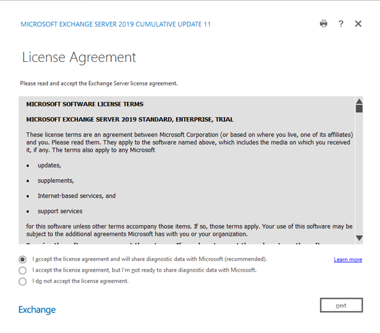

# Diagnostic Data collected for Exchange Server

Microsoft collects diagnostic data to keep Exchange Server secure and up to date, find and fix problems, and identify and mitigate threats. When the September 2021 (or later) CU is installed on a Mailbox server, Exchange Server 2016 or Exchange Server 2019 will have the ability to send diagnostic data from each Exchange server to the Office Config Service (OCS) in the Microsoft cloud. There is a change to the License Agreement acceptance process to allow you to choose whether to share diagnostic data with Microsoft.

## Change in License Term acceptance process

When using the GUI version of Exchange Setup, a new License Agreement screen will appear, as shown below.

Instead of two options, there are now three options.



Choose one of the following options:

<br>

****

|Selection|Description|
|:-----|:-----|
|**I accept the license agreement and will share diagnostic data with Microsoft**|This is the default option that accepts the license agreement and enables sending data to Microsoft.|
|**I accept the license agreement, but I’m not ready to share diagnostic data with Microsoft**| This option accepts the license agreement but disables sending data to Microsoft.|
|**I do not accept the license agreement**|If you don’t accept the EULA, you cannot install the CU.|
|

### Unattended Setup of Exchange Server

The acceptance options are also available via an unattended command-line setup using the new Setup switches:

<br>

****

|Selection|Description|
|---|---|
|**/IAcceptExchangeServerLicenseTerms_DiagnosticDataON**|Use this switch to accept the license terms and send optional data to Microsoft when the EM service requests mitigations.|
|**/IAcceptExchangeServerLicenseTerms_DiagnosticDataOFF**|Use this new setup switch to accept the license terms and disable sending optional data to Microsoft.|
|

> [!IMPORTANT]
> **/IAcceptExchangeServerLicenseTerms** has been removed from Exchange server command-line Setup and replaced with the two new Setup switches shown above.

## Diagnostic Data collected

When diagnostic data collection is enabled, your Exchange server sends the following information hourly to the Office Config Service:

|Data|Description|
|:-----|:-----|
|Exchange build number|The server version (CU and SU build information).|
|Emergency Mitigation service state|Information about the admin-configured behavior of the EM service (for example, whether to send data and/or automatically mitigate).|
|Immutable Device ID|Unique identification for the Server.|
|Immutable Org ID|Unique identification for each Exchange organization.|
|Applied mitigations|A list of all mitigations that were applied.|
|Blocked mitigations|A list of all mitigations that were blocked by an admin.|

## How to configure the Diagnostic Data setting after installation is complete

After the Setup has completed, you can enable and disable sending the diagnostic data to the OCS on any Exchange server using the **Set-ExchangeServer** cmdlet.

To disable sending optional data to Microsoft:

```Powershell
Set-ExchangeServer -Identity <ServerName> -DataCollectionEnabled:$false
```

To enable sending optional data to Microsoft:

```Powershell
Set-ExchangeServer -Identity <ServerName> -DataCollectionEnabled:$true
```
